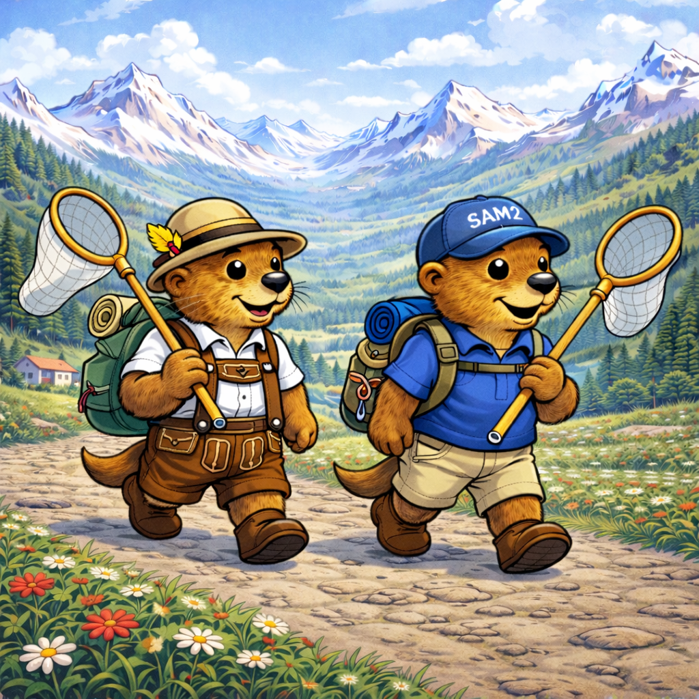

# SAM2-PAL: SAM2-Palindrome Self-Training with Cycle Consistency

<p align="center">
  
</p>
Multi-object palindrome-based self-training for efficient batch segmentation of morphological structures in taxonomic specimens.
This implementation is inspired by the OC-CCL (One-Click Cycle-Consistent Learning) methodology described in "Static Segmentation by Tracking" (Feng et al., 2025). This is an original implementation with extensions for multi-object and multi-template training, integrated with the Descriptron GUI (Van Dam & Štarhová Serbina, 2025) for taxonomic digitization workflows.

🎯 What is This?
SAM2-PAL enables you to:

Segment hundreds of specimens from a single annotated template
Train on multiple structures simultaneously (e.g., scape, antenna, eye)
Use multiple diverse templates for better generalization
Fine-tune SAM2 using palindrome-based cycle-consistent self-training
Integrate with Descriptron GUI for annotation workflows

Key advantage: Instead of training 3 separate models for 3 structures (scape, antenna, eye), train once and segment all structures simultaneously.

🔬 Methodology
The Palindrome Approach
The core training uses a 4-frame palindrome sequence with memory reset:
{x₀, x₁, x₁†, x₀†}

Phase 1: Forward Prediction
  x₀ (template with mask) → stored in memory
  x₁ (unlabeled specimen) → predict mask using template
  
[MEMORY RESET] ← Clears memory to prevent cheating

Phase 2: Backward Verification
  x₁† (unlabeled with predicted mask) → stored in memory
  x₀† (template) → predict mask using unlabeled prediction
  
Loss: Compare final prediction to original ground truth
Backprop: Update SAM2 weights end-to-end
Why this works:

Memory reset prevents memorization, forces generalization
Cycle consistency ensures forward and backward predictions agree
Differentiable predictions allow gradients to flow through entire sequence
Self-training leverages unlabeled data efficiently


Multi-Object Extension
For multiple structures on the same template:
For each unlabeled specimen:
  For each structure (scape, antenna, eye):
    Run palindrome sequence
    Compute structure-specific loss
  
  Total loss = sum of all structure losses
  Backprop once to update shared SAM2 backbone
Advantage: Structures share learned features (edges, textures, morphology), improving quality while reducing training time.

Multi-Template Support
Instead of one template, use multiple diverse specimens:
Training loop:
  For each unlabeled specimen:
    Randomly sample a template from [template_1, ..., template_N]
    Run palindrome training with sampled template
Advantage: Exposes model to variation in orientation, lighting, morphology → better generalization.

📦 Installation
Requirements

Python 3.8+
PyTorch 2.0+
CUDA 11.8+ (for GPU)
SAM2 (Segment Anything Model 2)

Setup
bash# Clone repository
git clone https://github.com/yourusername/SAM2-PAL.git
cd SAM2-PAL

# Create environment
conda create -n sam2pal python=3.10
conda activate sam2pal

# Install PyTorch with CUDA
pip install torch torchvision --index-url https://download.pytorch.org/whl/cu118

# Install SAM2
pip install git+https://github.com/facebookresearch/segment-anything-2.git

# Install dependencies
pip install opencv-python pillow numpy tqdm

# Install LoRA support (optional, for efficient fine-tuning)
pip install peft
Download SAM2 Checkpoint
bash# Large model (best quality)
wget https://dl.fbaipublicfiles.com/segment_anything_2/072824/sam2_hiera_large.pt

# Or Base+ model (faster)
wget https://dl.fbaipublicfiles.com/segment_anything_2/072824/sam2_hiera_base_plus.pt

🚀 Usage
Basic: Single Template, Single Structure
bashpython sam2_pal_batch_v17.py \
    --template_mask antenna_mask.png \
    --template_image specimen_001.jpg \
    --image_dir ./specimens/ \
    --output_dir ./results/ \
    --sam2_checkpoint sam2_hiera_large.pt \
    --model_cfg sam2_hiera_l.yaml
Output: COCO JSON with masks for all specimens in ./results/predictions.json

Multi-Object: One Template, Multiple Structures
Create a COCO JSON with all structures annotated on one template:
json{
  "images": [{
    "id": 1,
    "file_name": "template.jpg",
    "width": 2048,
    "height": 1536
  }],
  "annotations": [
    {
      "id": 1,
      "image_id": 1,
      "category_id": 1,
      "segmentation": [[...]],
      "bbox": [x, y, w, h]
    },
    {
      "id": 2,
      "image_id": 1,
      "category_id": 2,
      "segmentation": [[...]],
      "bbox": [x, y, w, h]
    },
    {
      "id": 3,
      "image_id": 1,
      "category_id": 3,
      "segmentation": [[...]],
      "bbox": [x, y, w, h]
    }
  ],
  "categories": [
    {"id": 1, "name": "scape"},
    {"id": 2, "name": "antenna"},
    {"id": 3, "name": "eye"}
  ]
}
Run segmentation:
bashpython sam2_pal_batch_v17_fixed.py \
    --template_json template_all_structures.json \
    --template_image template.jpg \
    --image_dir ./specimens/ \
    --output_dir ./results/ \
    --sam2_checkpoint sam2_hiera_large.pt
Result: Each specimen gets masks for scape, antenna, AND eye in one pass!

Multi-Template: Better Generalization
Annotate 3-5 diverse specimens (different angles, lighting, etc.) in one COCO JSON:
json{
  "images": [
    {"id": 1, "file_name": "specimen_001.jpg", ...},
    {"id": 2, "file_name": "specimen_002.jpg", ...},
    {"id": 3, "file_name": "specimen_003.jpg", ...}
  ],
  "annotations": [
    // Each image has scape + antenna + eye
    {"id": 1, "image_id": 1, "category_id": 1, ...},  // specimen_001 scape
    {"id": 2, "image_id": 1, "category_id": 2, ...},  // specimen_001 antenna
    {"id": 3, "image_id": 1, "category_id": 3, ...},  // specimen_001 eye
    {"id": 4, "image_id": 2, "category_id": 1, ...},  // specimen_002 scape
    // ... etc
  ],
  "categories": [...]
}
Run with training mode:
bashpython sam2_pal_batch_v17.py \
    --training_json three_templates.json \
    --image_dir ./unlabeled_specimens/ \
    --output_dir ./results/ \
    --sam2_checkpoint sam2_hiera_large.pt
Advantage: Model sees variation in morphology, lighting, angle → robust predictions!

Fine-Tuning with LoRA (Recommended)
Adapt SAM2 to your specific morphology:
bashpython sam2_pal_batch_v17_fixed.py \
    --template_json template.json \
    --template_image template.jpg \
    --image_dir ./specimens/ \
    --output_dir ./finetuned/ \
    --sam2_checkpoint sam2_hiera_large.pt \
    --pal_finetuning \
    --use_lora \
    --num_epochs 50 \
    --learning_rate 1e-4
Parameters:

--pal_finetuning - Enable palindrome training
--use_lora - Use LoRA for efficient fine-tuning (5× faster than full)
--num_epochs 50 - Training epochs (25-100 typical)
--learning_rate 1e-4 - LoRA learning rate (use 5e-6 for full fine-tuning)

Output:

./finetuned/best_checkpoint.pth - Fine-tuned weights
./finetuned/predictions.json - Results on training set

Use fine-tuned model:
bashpython sam2_pal_batch_v17_fixed.py \
    --template_json template.json \
    --template_image template.jpg \
    --image_dir ./new_specimens/ \
    --output_dir ./final_results/ \
    --sam2_checkpoint ./finetuned/best_checkpoint.pth

More example Recipes: 
1) Minimal: propagate from a template mask (no fine-tuning)
python sam2_pal_batch_v17.py \
  --template_image /path/to/template.jpg \
  --template_mask  /path/to/template_mask.png \
  --image_dir      /path/to/targets/ \
  --output_dir     /path/to/out_pal_v17/ \
  --sam2_checkpoint /path/to/checkpoints/sam2_hiera_large.pt \
  --sam2_config     /path/to/sam2_configs/sam2_hiera_l.yaml \
  --save_vis


Uses SAM2 tracking on a pseudo-video to propagate the template mask. 

sam2_pal_batch_v17

2) Multi-mask template via COCO JSON (train/predict multiple structures)
python sam2_pal_batch_v17.py \
  --template_image /path/to/template.jpg \
  --template_json  /path/to/template_multi_masks_coco.json \
  --image_dir      /path/to/targets/ \
  --output_dir     /path/to/out_pal_v17_multimask/ \
  --sam2_checkpoint /path/to/checkpoints/sam2_hiera_large.pt \
  --sam2_config     /path/to/sam2_configs/sam2_hiera_l.yaml \
  --multi_mask \
  --save_vis


v17 explicitly supports using all masks from --template_json for training templates (not just the first). 

sam2_pal_batch_v17

3) “Stability first” propagation (reduce drift)
python sam2_pal_batch_v17.py \
  --template_image /path/to/template.jpg \
  --template_json  /path/to/template_multi_masks_coco.json \
  --image_dir      /path/to/targets/ \
  --output_dir     /path/to/out_pal_v17_stable/ \
  --sam2_checkpoint /path/to/checkpoints/sam2_hiera_large.pt \
  --sam2_config     /path/to/sam2_configs/sam2_hiera_l.yaml \
  --interleave_template \
  --area_growth_limit 2.0 \
  --area_clamp_pad 15 \
  --save_vis


--interleave_template: builds [T, I1, T, I2, ...] to reduce drift

--area_growth_limit + --area_clamp_pad: clamps explosive mask growth using prior bbox 

sam2_pal_batch_v17

4) PAL fine-tuning (OC-CCL style) + LoRA (recommended)
python sam2_pal_batch_v17.py \
  --template_image /path/to/template.jpg \
  --template_json  /path/to/template_multi_masks_coco.json \
  --image_dir      /path/to/targets/ \
  --output_dir     /path/to/out_pal_v17_train_lora/ \
  --sam2_checkpoint /path/to/checkpoints/sam2_hiera_large.pt \
  --sam2_config     /path/to/sam2_configs/sam2_hiera_l.yaml \
  --pal_finetuning \
  --use_lora --lora_rank 16 \
  --num_epochs 25 --learning_rate 1e-4 \
  --max_images_per_epoch 100 \
  --save_vis


This runs the “PAL” (palindrome) fine-tuning path with the memory-reset logic described in the script header, then propagates. 

sam2_pal_batch_v17

5) PAL fine-tuning with multiple annotated training images (multi-template training)

If you have more than one annotated image (highly recommended), point PAL to a COCO file + directory:

python sam2_pal_batch_v17.py \
  --template_image /path/to/template.jpg \
  --template_json  /path/to/template_multi_masks_coco.json \
  --training_json  /path/to/training_set_coco.json \
  --training_images_dir /path/to/training_images/ \
  --image_dir      /path/to/targets/ \
  --output_dir     /path/to/out_pal_v17_multitemplate/ \
  --sam2_checkpoint /path/to/checkpoints/sam2_hiera_large.pt \
  --sam2_config     /path/to/sam2_configs/sam2_hiera_l.yaml \
  --pal_finetuning \
  --use_lora --lora_rank 16 \
  --num_epochs 25 --learning_rate 1e-4 \
  --max_images_per_epoch 100


--training_json/--training_images_dir loads additional training templates beyond the primary template. 

sam2_pal_batch_v17

6) Output naming conveniences
python sam2_pal_batch_v17.py \
  ... \
  --output_timestamp \
  --output_category_prefix


Adds timestamps to outputs and prefixes mask filenames with category names. 


Recipes — v10 True Video
1) End-to-end: video → frames → train → predict COCO
python sam2_finetune_palindrome_video_v10.py \
  --input /path/to/video.mp4 \
  --annotations /path/to/keyframes_coco.json \
  --output_dir /path/to/out_video_v10/ \
  --sam2_checkpoint /path/to/checkpoints/sam2.1_hiera_large.pt \
  --model_cfg /path/to/configs/sam2.1/sam2.1_hiera_l.yaml \
  --use_lora --lora_rank 8 \
  --epochs 25 --learning_rate 1e-4 \
  --export_predictions predictions.json


Extracts frames into output_dir/frames

Fine-tunes using keyframes

Propagates through all frames and writes COCO predictions (streaming writer). 

sam2_finetune_palindrome_video_…

2) If you already extracted frames (recommended for control)
python sam2_finetune_palindrome_video_v10.py \
  --video_dir /path/to/frames_dir \
  --annotations /path/to/keyframes_coco.json \
  --output_dir /path/to/out_video_v10/ \
  --sam2_checkpoint /path/to/checkpoints/sam2.1_hiera_large.pt \
  --model_cfg /path/to/configs/sam2.1/sam2.1_hiera_l.yaml \
  --use_lora --lora_rank 8 \
  --epochs 25 --learning_rate 1e-4 \
  --export_predictions predictions.json


Same as above, but you control your own extraction / FPS. 

sam2_finetune_palindrome_video_…

3) Train once, predict many times (no retraining)
# Train (produces checkpoint)
python sam2_finetune_palindrome_video_v10.py \
  --video_dir /path/to/frames_dir \
  --annotations /path/to/keyframes_coco.json \
  --output_dir /path/to/out_video_v10/ \
  --use_lora --lora_rank 8 \
  --epochs 25 --learning_rate 1e-4

# Predict later (skip training, load checkpoint)
python sam2_finetune_palindrome_video_v10.py \
  --video_dir /path/to/frames_dir \
  --annotations /path/to/keyframes_coco.json \
  --output_dir /path/to/out_video_v10/ \
  --checkpoint /path/to/out_video_v10/sam2_palindrome_v10.pt \
  --skip_training \
  --export_predictions predictions.json


--skip_training + --checkpoint is the intended “predict-only” pathway in v10.


⚙️ Parameters Reference
Essential Arguments
ArgumentTypeDescription--template_maskpathTemplate mask PNG (alternative to JSON)--template_imagepathTemplate image JPG--template_jsonpathCOCO JSON with template annotations--image_dirpathDirectory of target images to segment--output_dirpathOutput directory for results--sam2_checkpointpathSAM2 checkpoint .pt file--model_cfgpathSAM2 config (sam2_hiera_l.yaml)
Training (OC-CCL Fine-Tuning)
ArgumentTypeDefaultDescription--pal_finetuningflagFalseEnable palindrome fine-tuning--use_loraflagFalseUse LoRA (recommended)--num_epochsint50Training epochs--learning_ratefloat1e-4LoRA: 1e-4, Full: 5e-6--lora_rankint16LoRA rank (lower=faster, less capacity)--accumulation_stepsint4Gradient accumulation--training_jsonpathNoneCOCO JSON with multiple training templates
Drift Prevention
ArgumentTypeDefaultDescription--area_growth_limitfloat2.0Max area growth ratio (0=disabled)--area_clamp_padint10Padding for bbox clamping--reanchor_everyint0Re-anchor every N frames (0=disabled)--interleave_templateflagFalseInsert template every other frame
Output Options
ArgumentTypeDefaultDescription--visualizeflagFalseSave visualization images--save_masksflagFalseSave individual mask PNGs

🎯 Key Advantages
1. Multi-Object Training
Problem: Need scape, antenna, and eye segmented
Traditional: Train 3 models separately
SAM2-PAL: Train once, get all 3 structures
Why better:

Shared backbone learns common morphological features
Faster than sequential training
Structures benefit from each other's learning


2. Multi-Template Support
Problem: Single template may not generalize well
Traditional: One template, hope for the best
SAM2-PAL: Use 3-5 diverse templates
Why better:

Exposes model to natural variation
More robust to different angles, lighting
Better generalization to unseen specimens


3. Cycle Consistency
Problem: Predictions drift over time
Traditional: One-way prediction accumulates errors
SAM2-PAL: Palindrome enforces consistency
Why better:

Forward and backward predictions must agree
Catches drift early
Self-correcting mechanism


4. Memory Reset
Problem: Model memorizes templates instead of generalizing
Traditional: Memory persists between predictions
SAM2-PAL: Reset between forward/backward phases
Why better:

Forces model to learn robust features
Prevents overfitting to specific template
Better transfer to new specimens


📁 Output Format
COCO JSON Structure
json{
  "images": [
    {
      "id": 1,
      "file_name": "specimen_001.jpg",
      "width": 2048,
      "height": 1536
    },
    ...
  ],
  "annotations": [
    {
      "id": 1,
      "image_id": 1,
      "category_id": 1,
      "segmentation": [[x1, y1, x2, y2, ...]],
      "bbox": [x, y, w, h],
      "area": 12345
    },
    ...
  ],
  "categories": [
    {
      "id": 1,
      "name": "scape",
      "supercategory": "morphology"
    },
    ...
  ]
}
Compatible with:

VGG Image Annotator (VIA)
CVAT
LabelMe
Detectron2
MMDetection
Your custom pipeline


🔧 Typical Workflows
Workflow 1: Quick Batch Segmentation
Goal: Segment 100 ant specimens, antenna only
Steps:

Annotate 1 specimen antenna (5 minutes)
Export as PNG mask or COCO JSON
Run SAM2-PAL on 100 specimens
Review results, fix errors if needed
Export measurements

Time: ~15 minutes total

Workflow 2: Multi-Structure Morphometrics
Goal: Measure scape length, antenna segments, eye size for 200 specimens
Steps:

Annotate 1 specimen with all 3 structures (10 minutes)
Save as COCO JSON
Run multi-object segmentation on 200 specimens
Review results
Extract morphometric measurements from masks

Time: ~30 minutes total

Workflow 3: Fine-Tuned Species-Specific Model
Goal: Process 1000 specimens with maximum accuracy
Steps:

Annotate 5 diverse specimens with all structures (30 minutes)
Save as COCO JSON training set
Fine-tune SAM2 using palindrome training (15 minutes)
Run fine-tuned model on remaining 995 specimens
Spot-check quality, fix outliers
Export final dataset

Time: ~90 minutes total for 1000 specimens

🧪 Use Cases
Museum Digitization

High-throughput processing of pinned specimens
Consistent measurements across large collections
Multi-structure morphometric datasets

Taxonomic Research

Species delimitation via morphometrics
Comparative morphology across genera
Automated character state extraction

Biodiversity Monitoring

Rapid processing of Malaise trap catches
Morphological identification support
Integration with DNA barcoding pipelines


🐛 Troubleshooting
Issue: Masks drift to nearby structures
Solution 1: Enable area growth limiting
bash--area_growth_limit 2.0  # Clamps masks growing >2× in size
--area_clamp_pad 10      # Padding around previous bbox
Solution 2: Use template interleaving
bash--interleave_template  # Inserts template every other frame
Solution 3: Fine-tune with more diverse templates
bash--training_json five_diverse_templates.json
--pal_finetuning --use_lora

Issue: Out of GPU memory
Solution 1: Use smaller SAM2 model
bash--sam2_checkpoint sam2_hiera_base_plus.pt  # Instead of large
Solution 2: Reduce LoRA rank
bash--lora_rank 8  # Instead of default 16
Solution 3: Increase gradient accumulation
bash--accumulation_steps 8  # Instead of default 4

Issue: Low segmentation quality
Solution 1: Use multi-template training
bash# Annotate 3-5 diverse specimens instead of 1
--training_json multiple_templates.json
Solution 2: Fine-tune instead of zero-shot
bash--pal_finetuning --use_lora --num_epochs 50
Solution 3: Check template quality

Ensure template is well-focused
Good lighting
Clear structure boundaries
Representative of collection

## Citation

If you use this work, please cite:

\```bibtex
@software{Van Dam, Alex R.},
  title = {{SAM2-PAL}: Multi-Object Extension},
  author = {Your Name},
  year = {2025},
  url = {https://github.com/alexrvandam/SAM2-PAL}
}
\```

This work builds on:

**Descriptron GUI:**
\```bibtex
@article{vandam2025descriptron,
  author = {Van Dam, Alex R. and Štarhová Serbina, Liliya},
  title = {Descriptron: Artificial intelligence for automating taxonomic species descriptions...},
  journal = {Systematic Entomology},
  doi = {10.1111/syen.70005},
  year = {2025}
}
\```

**OC-CCL Methodology:**
\```bibtex
@misc{feng2025staticsegmentationtrackinglabelefficient,
  title = {Static Segmentation by Tracking...},
  author = {Feng, Zhenyang and ...},
  eprint = {2501.06749},
  year = {2025}
}
\```

**SAM2:**
\```bibtex
@misc{ravi2024sam2segmentimages,
  title = {{SAM} 2: Segment Anything in Images and Videos},
  author = {Ravi, Nikhila and ...},
  eprint = {2408.00714},
  year = {2024}
}
\```

